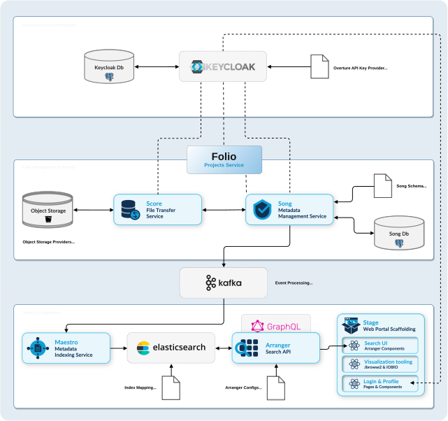

# AGARI Genomics Data Management Stack

Complete Overture stack deployment on Kubernetes with authentication, file management, and data indexing.



## Prerequisites

- Kubernetes cluster (k3d recommended for dev)
- kubectl configured  
- Helm 3.x installed
- nginx-ingress controller

## Quick Deploy

### 1. Setup Cluster

In dev you might want to use **k3d** for quick setup:

```bash
k3d cluster create agari --agents 2 --port "80:80@loadbalancer"

# Install nginx ingress
kubectl apply -f https://raw.githubusercontent.com/kubernetes/ingress-nginx/controller-v1.8.1/deploy/static/provider/cloud/deploy.yaml

# Wait for readiness
kubectl wait --namespace ingress-nginx --for=condition=ready pod --selector=app.kubernetes.io/component=controller --timeout=300s
```

### 2. Create Namespace

```bash
kubectl create namespace agari
```

### 3. Deploy Infrastructure

#### 3.1 MINIO Object storage


```bash
helm install minio ./helm/minio -n agari

# Minio might require prot-forwarding:
kubectl port-forward -n agari service/minio 9000:9000
```

#### 3.2 Setup Keycloak

```bash
# Database
helm install keycloak-db ./helm/keycloak-db -n agari

# Keycloak
helm install keycloak ./helm/keycloak -n agari
```

Set up the **client** in Keycloak and copy the **secret** to **song**, **score**, **maestro** and **folio** `values.yaml`

use `utils/update-secrets.sh` script to update the secrets in all services

#### 5.3 ELASTICSEARCH
```bash
# Elasticsearch
helm install elasticsearch ./helm/elasticsearch -n agari

# Create agari-index with proper mapping
curl -X PUT "http://elasticsearch.local/agari-index" \
    -H "Content-Type: application/json" \
    -d @helm/elasticsearch/configs/agari-index-mapping.json
```

#### 3.4 FOLIO Projects Service

**Find Folio repo at [https://github.com/OpenUpSA/agari-folio](https://github.com/OpenUpSA/agari-folio)**

```bash
# Database
helm install folio-db ./helm/folio-db -n agari

# Folio
helm install folio ./helm/folio -n agari

```


## Ingress Configuration

For local development, you can use `/etc/hosts` to map the services:

```bash
echo "127.0.0.1 keycloak.local
127.0.0.1 elasticsearch.local
127.0.0.1 minio-console.local
127.0.0.1 folio.local" | sudo tee -a /etc/hosts
```

## Set SSL cert secret

```
kubectl create secret tls folio-prod-tls-cert --cert=/path/to/tls.crt --key=/path/to/tls.key -n agari-prod
```


## Service Access

Services are available at these URLs:

- **Keycloak**: http://keycloak.local
- **Elasticsearch**: http://elasticsearch.local
- **MinIO Console**: http://minio-console.local
- **Folio**: http://folio.local/docs

## Authentication and Authorization

### Default Credentials
- **Keycloak Admin**: admin / admin123

### Basic End to End Requirements

- **Realm**: `agari`

  - **Group**:
    - `admin`
  - **User**:
    - `admin` / `admin123` (member of `admin` group) 
  - **Client**:
    - `dms` - Data Management System (for SONG, Score, Maestro). Policy enforcement: `permissive` and Decision strategy: `affirmative`
      - **Scopes**:
        - `READ`
        - `WRITE`
        - `ADMIN`
      - **Resources**:
        - `song` - SONG API - with `READ` and `WRITE` scopes
        - `score` - Score API - with `READ` and `WRITE` scopes
        - `folio` - Folio API - with `READ` and `WRITE` scopes
      - **Policies**:
        - `admin-policy` - group policy - with `admin` group
        - `client-policy` - client policy - with `dms` client (**This is very Important as it enables song and score to communicate**)
      - **Permissions**:
        - `admin-permission` - resources `song`, `score` and `folio` with `admin-policy`
        - `client-permission` - resources `song`, `score` and `folio` with `client-policy`
      - **Service account roles**:
        - `realm-admin` - to allow service account (folio) to manage users and roles programmatically

### JWT Token Example
```bash
# Get JWT token from Keycloak
curl -d "client_id=song-api" \
     -d "client_secret=song-secret" \
     -d "username=admin@example.com" \
     -d "password=admin123" \
     -d "grant_type=password" \
     "http://keycloak.local/realms/agari/protocol/openid-connect/token"
```

## Data Flow - outdated

1. **Submit metadata** → SONG validates and stores in PostgreSQL
2. **Upload files** → Score stores in MinIO object storage  
3. **Analysis events** → Kafka message queue
4. **Index data** → Maestro processes and indexes in Elasticsearch
5. **Query data** → Arranger provides GraphQL API

## GraphQL Query Examples  - outdated

Visit http://arranger.local/graphql to access the GraphQL playground. Here are example queries you can copy and paste:


### 1. Basic File Query - Get all files with basic metadata
```graphql
query {
  file {
    hits {
      total
    }
  }
}
```

### 2. Show available fields in the schema
```graphql
query {
  __type(name: "fileNode") {
    name
    fields {
      name
      type {
        name
      }
    }
  }
}

### 3. Big query
```graphql
query GetFilesWithAnalysis {
  file {
    hits {
      total
      edges {
        node {
          id
          data_type
          file_access
          file_type
          object_id
          study_id
          analysis {
            analysis_id
            analysis_type
            analysis_state
            analysis_version
            experiment
            first_published_at
            published_at
            updated_at
          }
          file {
            name
            size
            md5sum
          }
        }
      }
    }
  }
}

```

## Troubleshooting

### Check service status
```bash
kubectl get pods -n agari
kubectl get ingress -n agari
```

### View logs
```bash
kubectl logs <pod-name> -n agari
```

### Pause and unpause all pods in a namespace

Great for freeing up some system resources when idle

```bash
kubectl scale --replicas=0 deployment --all -n agari
kubectl scale --replicas=1 deployment --all -n agari
```

## Configuration

Key configuration files:
- `helm/*/values.yaml` - Service configurations
- `helm/elasticsearch/configs/agari-index-mapping.json` - Elasticsearch schema