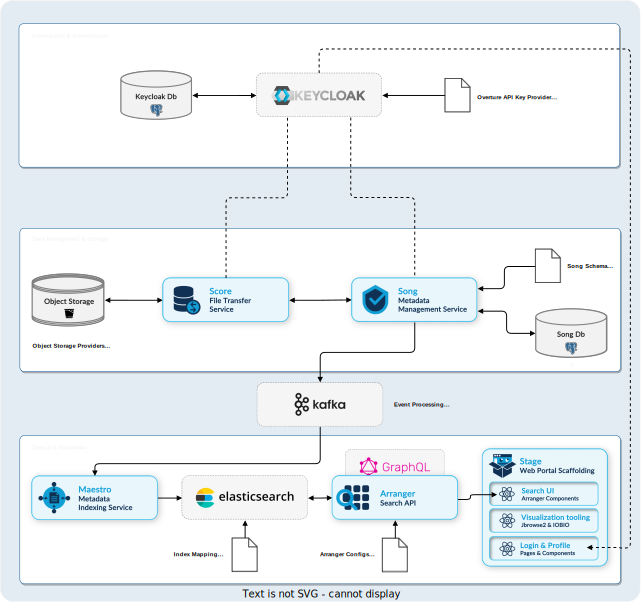

# AGARI Genomics Data Management Stack

Complete Overture stack deployment on Kubernetes with authentication, file management, and data indexing.



## Prerequisites

- Kubernetes cluster (k3d recommended for dev)
- kubectl configured  
- Helm 3.x installed
- nginx-ingress controller

## Quick Deploy

### 1. Setup Cluster

In dev you might want to use **k3d** for quick setup:

```bash
k3d cluster create agari-dev --agentgroupss 2 --port "80:80@loadbalancer"

# Install nginx ingress
kubectl apply -f https://raw.githubusercontent.com/kubernetes/ingress-nginx/controller-v1.8.1/deploy/static/provider/cloud/deploy.yaml

# Wait for readiness
kubectl wait --namespace ingress-nginx --for=condition=ready pod --selector=app.kubernetes.io/component=controller --timeout=300s
```

### 2. Create Namespace

```bash
kubectl create namespace agari-dev
```

### 3. Deploy Infrastructure

```bash
# Object storage
helm install minio ./helm/minio -n agari-dev

# Minio might require prot-forwarding:
kubectl port-forward -n agari-dev service/minio 9000:9000

# Message queue
helm repo add bitnami https://charts.bitnami.com/bitnami
helm install kafka bitnami/kafka -f helm/kafka/values-bitnami.yaml -n agari-dev
```

### 4. Setup Keycloak

```bash
# Database
helm install keycloak-db ./helm/keycloak-db -n agari-dev

# Keycloak
helm install keycloak ./helm/keycloak -n agari-dev
```

Set up the **client** in Keycloak and copy the **secret** to **song**, **score** and **maestro** `values.yaml`

### 5. Deploy Overture Stack

```bash
# SONG  
helm install song-db ./helm/song-db -n agari-dev
helm install song ./helm/song -n agari-dev

# SCORE
helm install score ./helm/score -n agari-dev

# ELASTICSEARCH
helm install elasticsearch ./helm/elasticsearch -n agari-dev

# Create agari-index with proper mapping
curl -X PUT "http://elasticsearch.local/agari-index" \
    -H "Content-Type: application/json" \
    -d @helm/elasticsearch/configs/agari-index-mapping.json

# MAESTRO
helm install maestro ./helm/maestro -n agari-dev

# ARRANGER
# Set up Arranger configuration
kubectl create configmap arranger-config --from-file=helm/arranger/configs/ -n agari-dev

helm install arranger ./helm/arranger -n agari-dev
```

## Service Access

Services are available at these URLs:

- **SONG API**: http://song.local
- **Score API**: http://score.local  
- **Arranger GraphQL**: http://arranger.local/graphql
- **Keycloak**: http://keycloak.local
- **Elasticsearch**: http://elasticsearch.local
- **MinIO Console**: http://minio-console.local

## Authentication and Authorization

### Default Credentials
- **Keycloak Admin**: admin / admin123

### Basic End to End Requirements

- **Realm**: `agari`

  - **Group**:
    - `admin`
  - **User**:
    - `admin` / `admin123` (member of `admin` group) 
  - **Client**:
    - `dms` - Data Management System (for SONG, Score, Maestro). Policy enforcement: `permissive` and Decision strategy: `affirmative`
      - **Scopes**:
        - `READ`
        - `WRITE`
      - **Resources**:
        - `song` - SONG API - with `READ` and `WRITE` scopes
        - `score` - Score API - with `READ` and `WRITE` scopes
      - **Policies**:
        - `admin-policy` - group policy - with `admin` group
        - `client-policy` - client policy - with `dms` client (**This is very Important as it enables song and score to communicate**)
      - **Permissions**:
        - `admin-permission` - resources `song` and `score` with `admin-policy`
        - `client-permission` - resources `song` and `score` with `client-policy`

### JWT Token Example
```bash
# Get JWT token from Keycloak
curl -d "client_id=song-api" \
     -d "client_secret=song-secret" \
     -d "username=admin@example.com" \
     -d "password=admin123" \
     -d "grant_type=password" \
     "http://keycloak.local/realms/agari/protocol/openid-connect/token"
```

## Data Flow

1. **Submit metadata** → SONG validates and stores in PostgreSQL
2. **Upload files** → Score stores in MinIO object storage  
3. **Analysis events** → Kafka message queue
4. **Index data** → Maestro processes and indexes in Elasticsearch
5. **Query data** → Arranger provides GraphQL API

## GraphQL Query Examples

Visit http://arranger.local/graphql to access the GraphQL playground. Here are example queries you can copy and paste:


### 1. Basic File Query - Get all files with basic metadata
```graphql
query {
  file {
    hits {
      total
      edges {
        node {
          id
          score
        }
      }
    }
  }
}
```

### 2. Show available fields in the schema
```graphql
query {
  __type(name: "fileNode") {
    name
    fields {
      name
      type {
        name
      }
    }
  }
}
```

## Troubleshooting

### Check service status
```bash
kubectl get pods -n agari-dev
kubectl get ingress -n agari-dev
```

### View logs
```bash
kubectl logs <pod-name> -n agari-dev
```


## Configuration

Key configuration files:
- `helm/*/values.yaml` - Service configurations
- `helm/elasticsearch/configs/agari-index-mapping.json` - Elasticsearch schema